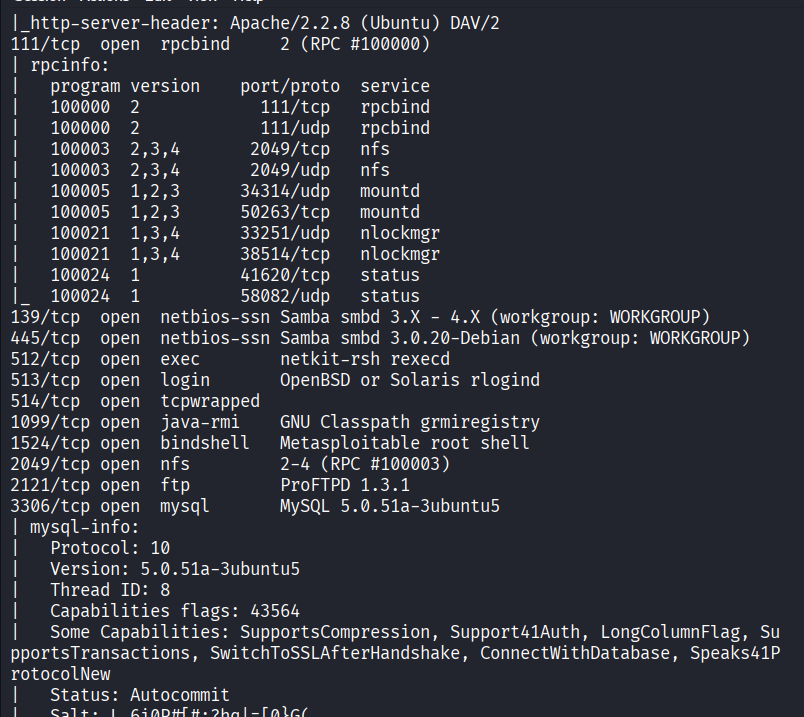

# 🛡️ Mini Vulnerability Scanner (Python)

A Python-based **educational vulnerability scanner** that performs:

- 🔍 Port scanning  
- 🌐 Service detection  
- 🏷️ Banner grabbing  
- ⚠️ Basic risk assessment  
- 📄 Automatic report generation (CSV)

> ⚠️ This tool is for **educational purposes only**. Only scan systems you own or have permission to test.

---

## 🚀 Features

- Scan target for open TCP ports
- Identify common services (HTTP, SSH, FTP, etc.)
- Grab service banners
- Flag dangerous services (FTP, Telnet, exposed DB, RDP)
- Generate structured scan reports
- Clean modular code structure

---
## 🔍 Lab Validation (Nmap)

This project was tested against the **Metasploitable2** vulnerable VM using **Kali Linux** and **Nmap**.

## 🗂️ Project Structure

mini-vuln-scanner/
├── scanner/
│ ├── port_scanner.py
│ ├── banner_grabber.py
│ └── vuln_checks.py
├── reports/
├── assets/
├── run_scanner.py
└── README.md
